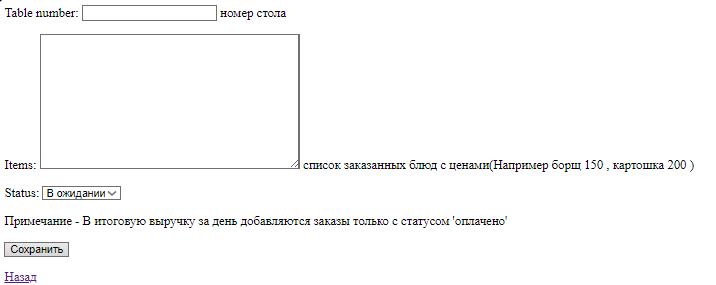

Запуск
```
python -m venv venv
venv\Scripts\activate
pip install django psycopg asyncpg
python manage.py makemigrations orders
python manage.py migrate
cd cafe
python manage.py runserver
```


Подробнее о том , что сделал 
```
Взял SQLite (через  Django ORM ) локально , 
без докер контейнеров
Есть Возможность редактирования заказа (добавление или удаление блюд)
```